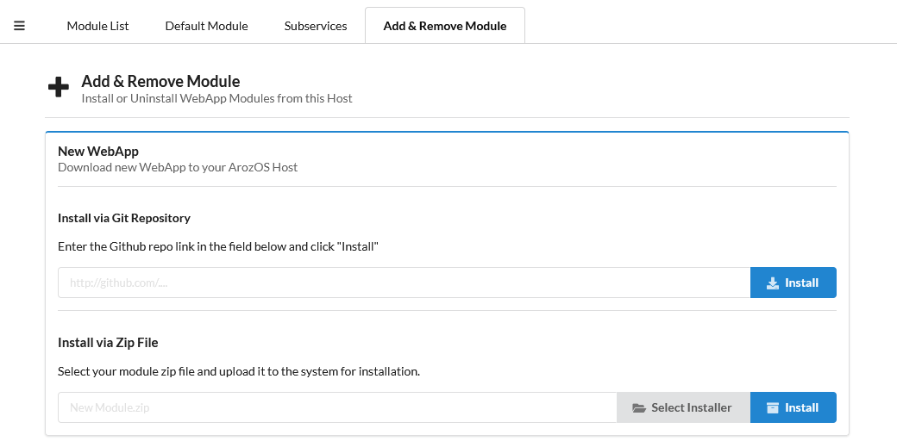

["Installing WebApps and Subservices"]

# Installation WebApps and Subservices

## WebApps

WebApps in ArozOS are HTML5 written web application that allow on runtime installation and installation using the Module Installer. 

ArozOS WebApps can only access the backend through the ArOZ JavaScript Gateway Interface (AGI for short) or AJAX request to the ArozOS system endpoints. WebApp on ArozOS do not contains platform dependent code that would require compilation on installation.

You can find all your installed WebApps under the ./web folder inside your ArozOS root folder.

### Installation of WebApp

You can install WebApp using git repo URL or a zip file. You can find the installation interface in the System Setting > Add & Remove Module tab



To install via git repo URL, copy the repo URL from your desired WebApp home page and paste it into the input box under "Install via Git Repository" field.

You can take a look at the WebApp git template here:

https://github.com/aroz-online/BasicTemplate


To install via zip file, compress the WebApp in zip format and upload to a location that is accessible by your permission. (e.g. user:/Desktop), and then click "Select Installer" under "Install via Zip File" and select the zip file your just uploaded. Finally, press "Install" to start installation.


### Remove of WebApp

To remove WebApp, select your WebApp to be removed from the WebApp list and click "Uninstall"


### Manual Install / Remove of WebApp

To manually install and remove WebApp, simpily go to the ./web under ArozOS root and remove the folder containing your WebApp using

```
rm -rf ./MyWebApp
```

and restart the ArozOS system.

## Subservice

Subservice in ArozOS  are executables that require compilation on install. Subservices are mostly installed by the OEM manufacturer or Makers with technical backgrounds. Subservice installation can only be done via the host system shell (or ssh / terminal, depends on what you prefer to call it) and reboot of the system is required to make the installation effective.

ArozOS Subservice can access the system OS directly as it is executed as a "process" in the OS level. Subservice can also access ArozOS core functions using AGI interface with request tokens. In most case, subservice contains platform dependent codes and sometime also architecture dependent codes (e.g. ARM vs amd64). 

You can find all your installed Subservices under ./subservice folder inside your ArozOS root folder.